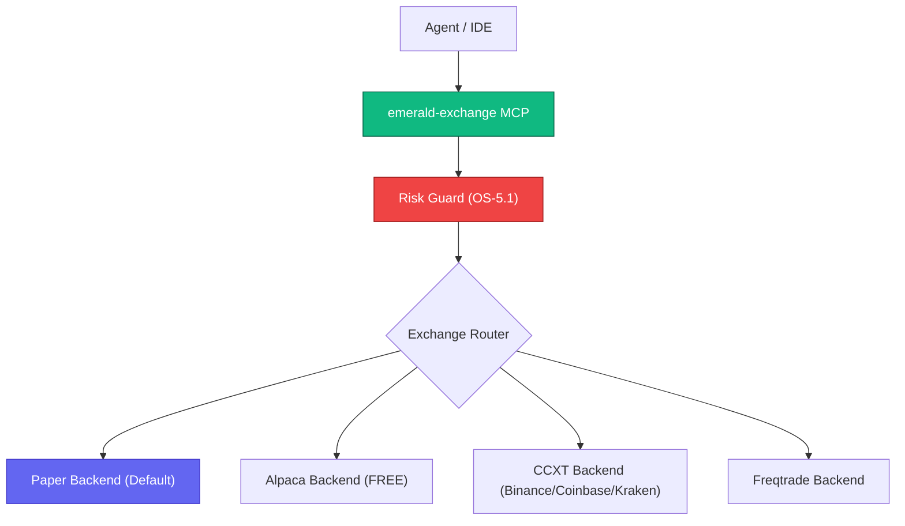

# Emerald Exchange - API | MCP | A2A


*Version: 0.18.0*

> **Documentation** — Installation, deployment, usage across the API, CLI, and MCP
> interfaces, the A2A agent server, and the trading configuration schema are
> maintained in the [official documentation](https://knuckles-team.github.io/emerald-exchange/).

## Overview

Emerald Exchange is a unified Finance MCP Server providing fully abstracted exchange backends
for equities, crypto, and derivatives trading. All trading functionality is tool-driven via MCP,
with built-in financial hardening controls (OS-5.1).

**Key Features:**
- **5 Exchange Backends**: Paper (default), Alpaca (FREE), CCXT (100+ exchanges), Freqtrade
- **6 MCP Tool Domains**: market-data, orders, portfolio, risk, signals, strategy
- **Financial Hardening**: Paper-first default, Kelly criterion position sizing, circuit breakers, kill switch
- **Config-Driven**: All settings via `~/.config/agent-utilities/config.json`

## Architecture



## MCP Tools

_Auto-generated from the live MCP server — do not edit by hand._

<!-- MCP-TOOLS-TABLE:START -->

| MCP Tool | Toggle Env Var | Description |
|----------|----------------|-------------|
| `ee_prediction_markets` | — | Prediction Markets operations. |
| `emerald_crypto` | `CRYPTOTOOL` | Crypto-native analytics and arbitrage. CONCEPT:EE-015 |
| `emerald_debate` | `DEBATETOOL` | Multi-agent trading debate engine. CONCEPT:EE-014 |
| `emerald_derivatives` | `DERIVATIVESTOOL` | SABR volatility surface + vol-arb. CONCEPT:EE-034 |
| `emerald_fundamentals` | — | SEC EDGAR fundamentals operations. CONCEPT:EE-027. |
| `emerald_market_data` | `MARKET-DATATOOL` | Market data operations. CONCEPT:EE-008 |
| `emerald_market_making` | `MARKET_MAKINGTOOL` | Market-making controller, fee model, and forensic screener. CONCEPT:EE-023 |
| `emerald_orders` | `ORDERSTOOL` | Order management with pre-trade risk validation. CONCEPT:EE-009 |
| `emerald_portfolio` | `PORTFOLIOTOOL` | Portfolio management operations. CONCEPT:EE-010 |
| `emerald_risk` | `RISKTOOL` | Risk management and monitoring. CONCEPT:EE-011 |
| `emerald_signals` | `SIGNALSTOOL` | Signal generation and fusion. Routes to agent-utilities finance domain. CONCEPT:EE-012 |
| `emerald_statarb` | `STATARBTOOL` | OU statistical-arbitrage signal + dynamic-beta hedge. CONCEPT:EE-030 |
| `emerald_strategy` | `STRATEGYTOOL` | Strategy lifecycle management. CONCEPT:EE-013 |
| `emerald_wallet_intel` | — | Polymarket wallet-intelligence operations. CONCEPT:EE-028. |

_14 action-routed tools (default `MCP_TOOL_MODE=condensed`). Each is enabled unless its toggle is set false; set `MCP_TOOL_MODE=verbose` (or `both`) for the 1:1 per-operation surface. Auto-generated — do not edit._
<!-- MCP-TOOLS-TABLE:END -->

## Exchange Backends

| Backend | Assets | Paper | Live | Free |
|---------|--------|-------|------|------|
| Paper | All | ✅ | — | ✅ |
| Alpaca | Equities, Crypto | ✅ | ✅ | ✅ |
| CCXT (Binance) | Crypto | ✅ | ✅ | ✅ |
| CCXT (Coinbase) | Crypto | ✅ | ✅ | ✅ |
| CCXT (Kraken) | Crypto | ✅ | ✅ | ✅ |
| Freqtrade | Crypto | ✅ | ✅ | ✅ |
| Prediction Markets (Kalshi/Polymarket) | Events/Weather | ✅ | ✅ | ✅ |

## Financial Hardening (OS-5.1)

| Control | Default |
|---------|---------|
| Trading Mode | Paper (must explicitly opt into live) |
| Max Position Size | 2% of portfolio (Kelly criterion) |
| Max Portfolio Drawdown | 10% auto-halt |
| Max Daily Loss | 3% auto-halt |
| Regime Shift Detection | KS-test auto-halt |
| Human Approval for Live | Required |
| Kill Switch | `emerald_orders(action="halt")` |

## Usage

### MCP Configuration

#### stdio Mode
```json
{
  "mcpServers": {
    "emerald-exchange": {
      "command": "uv",
      "args": ["run", "--with", "emerald-exchange", "emerald-exchange"],
      "env": {}
    }
  }
}
```

#### Streamable HTTP Mode
```bash
emerald-exchange --transport streamable-http --port 8100
```

### Configuration

All trading settings are configured via `~/.config/agent-utilities/config.json`:

```json
{
  "trading": {
    "default_mode": "paper",
    "default_exchange": "alpaca",
    "exchanges": {
      "alpaca": {
        "enabled": true,
        "api_key_env": "ALPACA_API_KEY",
        "api_secret_env": "ALPACA_SECRET_KEY",
        "base_url": "https://paper-api.alpaca.markets"
      }
    },
    "risk_limits": {
      "max_position_pct": 0.02,
      "max_portfolio_drawdown_pct": 0.10,
      "max_daily_loss_pct": 0.03,
      "require_human_approval_live": true
    }
  }
}
```

<!-- BEGIN GENERATED: additional-deployment-options -->
### Additional Deployment Options

`emerald-exchange` can also run as a **local container** (Docker / Podman / `uv`) or be
consumed from a **remote deployment**. The
[Deployment guide](https://knuckles-team.github.io/emerald-exchange/deployment/) has full, copy-paste
`mcp_config.json` for all four transports — **stdio**, **streamable-http**,
**local container / uv**, and **remote URL**:

- **Local container / uv** — launch the server from `mcp_config.json` via `uvx`,
  `docker run`, or `podman run`, or point at a local streamable-http container by `url`.
- **Remote URL** — connect to a server deployed behind Caddy at
  `http://emerald-exchange-mcp.arpa/mcp` using the `"url"` key.
<!-- END GENERATED: additional-deployment-options -->

## ⚙️ Dynamic Tool Selection & Visibility

This MCP server supports dynamic toolset selection and visibility filtering at runtime. This allows you to restrict the set of exposed tools in order to prevent blowing up the LLM's context window.

You can configure tool filtering via multiple input channels:

- **CLI Arguments:** Pass `--tools` or `--toolsets` (or their disabled counterparts `--disabled-tools` and `--disabled-toolsets`) during startup.
- **Environment Variables:** Define standard environment variables:
  - `MCP_ENABLED_TOOLS` / `MCP_DISABLED_TOOLS`
  - `MCP_ENABLED_TAGS` / `MCP_DISABLED_TAGS`
- **HTTP SSE Request Headers:** Pass custom headers during transport initialization:
  - `x-mcp-enabled-tools` / `x-mcp-disabled-tools`
  - `x-mcp-enabled-tags` / `x-mcp-disabled-tags`
- **HTTP SSE Request Query Parameters:** Append query parameters directly to your transport connection URL:
  - `?tools=tool1,tool2`
  - `?tags=tag1`

When query strings or parameters are supplied, an LLM-free **Knowledge Graph resolution layer** (using `DynamicToolOrchestrator`) matches query intents against known tool tags, names, or descriptions, with safe fallback and automated 24-hour background cache refreshing.


---

## Installation

```bash
pip install emerald-exchange           # Core + paper backend
pip install emerald-exchange[alpaca]   # + Alpaca equities
pip install emerald-exchange[crypto]   # + CCXT crypto
pip install emerald-exchange[prediction_markets] # + Kalshi & Polymarket
pip install emerald-exchange[all]      # Everything
```

## Docker

```bash
docker compose -f docker/compose.yml up -d
```

## Documentation

The complete documentation is published as the
[official documentation site](https://knuckles-team.github.io/emerald-exchange/) and is the
recommended reference for installation, deployment, and day-to-day operation.

| Page | Contents |
|---|---|
| [Installation](https://knuckles-team.github.io/emerald-exchange/installation/) | pip, source, extras, prebuilt Docker image |
| [Deployment](https://knuckles-team.github.io/emerald-exchange/deployment/) | run the MCP and agent servers, Compose, Caddy + Technitium, env config |
| [Usage](https://knuckles-team.github.io/emerald-exchange/usage/) | the MCP tools, the Python API, the cockpit CLI |
| [Overview](https://knuckles-team.github.io/emerald-exchange/overview/) | enterprise features, tool surface, architecture |
| [Configuration Schema](https://knuckles-team.github.io/emerald-exchange/config_schema/) | the `trading` config block and backend matrix |
| [Concepts](https://knuckles-team.github.io/emerald-exchange/concepts/) | concept registry (`CONCEPT:EE-*`) |

`AGENTS.md` is the canonical contributor/agent guidance.


<!-- BEGIN agent-os-genesis-deploy (generated; do not edit between markers) -->

## Deploy with `agent-os-genesis`

This package can be provisioned for you — skill-guided — by the **`agent-os-genesis`**
universal skill (its *single-package deploy mode*): it picks your install method, seeds
secrets to OpenBao/Vault (or `.env`), trusts your enterprise CA, registers the MCP
server, and verifies it — the same machinery that stands up the whole Agent OS, narrowed
to just this package. Ask your agent to **"deploy `emerald-exchange` with agent-os-genesis"**.

| Install mode | Command |
|------|---------|
| Bare-metal, prod (PyPI) | `uvx emerald-exchange-mcp` · or `uv tool install emerald-exchange` |
| Bare-metal, dev (editable) | `uv pip install -e ".[all]"` · or `pip install -e ".[all]"` |
| Container, prod | deploy `knucklessg1/emerald-exchange:latest` via docker-compose / swarm / podman / podman-compose / kubernetes |
| Container, dev (editable) | deploy `docker/compose.dev.yml` (source-mounted at `/src`; edits live on restart) |

Secrets are read-existing + seeded via `vault_sync` — you are only prompted for what's missing.

<!-- END agent-os-genesis-deploy -->
