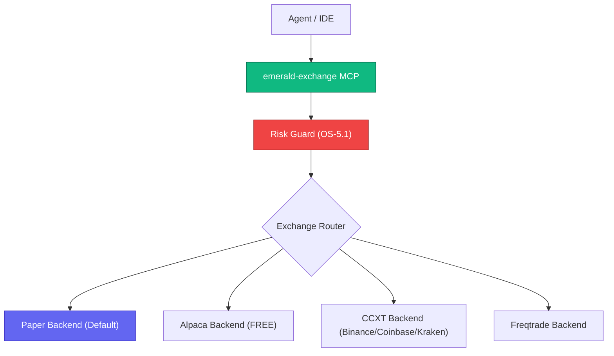

# Emerald Exchange - API | MCP | A2A


*Version: 1.0.0*

> **Documentation** — Installation, deployment, usage across the API, CLI, and MCP
> interfaces, the A2A agent server, and the trading configuration schema are
> maintained in the [official documentation](https://knuckles-team.github.io/emerald-exchange/).

## Overview

Emerald Exchange is a unified Finance MCP Server providing fully abstracted exchange backends
for equities, crypto, and derivatives trading. All trading functionality is tool-driven via MCP,
with built-in financial hardening controls (OS-5.1).

**Key Features:**
- **5 Exchange Backends**: Paper (default), Alpaca (FREE), CCXT (100+ exchanges), Freqtrade
- **6 MCP Tool Domains**: market-data, orders, portfolio, risk, signals, strategy
- **Financial Hardening**: Paper-first default, Kelly criterion position sizing, circuit breakers, kill switch
- **Config-Driven**: All settings via `~/.config/agent-utilities/config.json`

## Architecture



## MCP Tools

_Auto-generated from the live MCP server — do not edit by hand._

<!-- MCP-TOOLS-TABLE:START -->

#### Condensed action-routed tools (default — `MCP_TOOL_MODE=condensed`)

| MCP Tool | Toggle Env Var | Description |
|----------|----------------|-------------|
| `ee_prediction_markets` | `PREDICTION_MARKETTOOL` | Prediction Markets operations. |
| `emerald_crypto` | `CRYPTOTOOL` | Crypto-native analytics and arbitrage. CONCEPT:EE-015 |
| `emerald_debate` | `DEBATETOOL` | Multi-agent trading debate engine. CONCEPT:EE-014 |
| `emerald_derivatives` | `DERIVATIVESTOOL` | SABR volatility surface + vol-arb. CONCEPT:EE-034 |
| `emerald_fundamentals` | `FUNDAMENTALSTOOL` | SEC EDGAR fundamentals operations. CONCEPT:EE-027. |
| `emerald_market_data` | `MARKET_DATATOOL` | Market data operations. CONCEPT:EE-008 |
| `emerald_market_making` | `MARKET_MAKINGTOOL` | Market-making controller, fee model, and forensic screener. CONCEPT:EE-023 |
| `emerald_orders` | `ORDERTOOL` | Order management with pre-trade risk validation. CONCEPT:EE-009 |
| `emerald_portfolio` | `PORTFOLIOTOOL` | Portfolio management operations. CONCEPT:EE-010 |
| `emerald_risk` | `RISKTOOL` | Risk management and monitoring. CONCEPT:EE-011 |
| `emerald_signals` | `SIGNALTOOL` | Signal generation and fusion. Routes to agent-utilities finance domain. CONCEPT:EE-012 |
| `emerald_statarb` | `STATARBTOOL` | OU statistical-arbitrage signal + dynamic-beta hedge. CONCEPT:EE-030 |
| `emerald_strategy` | `STRATEGYTOOL` | Strategy lifecycle management. CONCEPT:EE-013 |
| `emerald_wallet_intel` | `WALLET_INTELTOOL` | Polymarket wallet-intelligence operations. CONCEPT:EE-028. |

#### Verbose 1:1 API-mapped tools (`MCP_TOOL_MODE=verbose` or `both`)

<details>
<summary>9 per-operation tools — one per public API method (click to expand)</summary>

| MCP Tool | Toggle Env Var | Description |
|----------|----------------|-------------|
| `emerald_cancel_order` | `PAPER_BACKENDTOOL` | Invoke the cancel_order operation. |
| `emerald_connect` | `PAPER_BACKENDTOOL` | Invoke the connect operation. |
| `emerald_disconnect` | `PAPER_BACKENDTOOL` | Invoke the disconnect operation. |
| `emerald_get_account` | `PAPER_BACKENDTOOL` | Invoke the get_account operation. |
| `emerald_get_historical` | `PAPER_BACKENDTOOL` | Invoke the get_historical operation. |
| `emerald_get_order_status` | `PAPER_BACKENDTOOL` | Invoke the get_order_status operation. |
| `emerald_get_positions` | `PAPER_BACKENDTOOL` | Invoke the get_positions operation. |
| `emerald_get_quote` | `PAPER_BACKENDTOOL` | Invoke the get_quote operation. |
| `emerald_submit_order` | `PAPER_BACKENDTOOL` | Invoke the submit_order operation. |

</details>

_14 action-routed tool(s) (default) · 9 verbose 1:1 tool(s). Each is enabled unless its `<DOMAIN>TOOL` toggle is set false; `MCP_TOOL_MODE` selects the surface (`condensed` default · `verbose` 1:1 · `both`). Auto-generated — do not edit._
<!-- MCP-TOOLS-TABLE:END -->

## Exchange Backends

| Backend | Assets | Paper | Live | Free |
|---------|--------|-------|------|------|
| Paper | All | ✅ | — | ✅ |
| Alpaca | Equities, Crypto | ✅ | ✅ | ✅ |
| CCXT (Binance) | Crypto | ✅ | ✅ | ✅ |
| CCXT (Coinbase) | Crypto | ✅ | ✅ | ✅ |
| CCXT (Kraken) | Crypto | ✅ | ✅ | ✅ |
| Freqtrade | Crypto | ✅ | ✅ | ✅ |
| Prediction Markets (Kalshi/Polymarket) | Events/Weather | ✅ | ✅ | ✅ |

## Financial Hardening (OS-5.1)

| Control | Default |
|---------|---------|
| Trading Mode | Paper (must explicitly opt into live) |
| Max Position Size | 2% of portfolio (Kelly criterion) |
| Max Portfolio Drawdown | 10% auto-halt |
| Max Daily Loss | 3% auto-halt |
| Regime Shift Detection | KS-test auto-halt |
| Human Approval for Live | Required |
| Kill Switch | `emerald_orders(action="halt")` |

## Usage

### MCP Configuration

> **Install the slim `[mcp]` extra.** The examples below install
> `emerald-exchange[mcp]` — the MCP-server extra that pulls only the FastMCP /
> FastAPI tooling (`agent-utilities[mcp]`). It deliberately **excludes** the heavy
> agent runtime (the epistemic-graph engine, `pydantic-ai`, `dspy`, `llama-index`,
> `tree-sitter`), so `uvx`/container installs are dramatically smaller and faster.
> Use the full `[agent]` extra only when you need the integrated Pydantic AI agent
> (see [Installation](#installation)). Add trading-backend extras (`[alpaca]`,
> `[crypto]`, `[prediction_markets]`, …) on top as needed.

#### stdio Mode
```json
{
  "mcpServers": {
    "emerald-exchange": {
      "command": "uvx",
      "args": ["--from", "emerald-exchange[mcp]", "emerald-exchange-mcp"],
      "env": {}
    }
  }
}
```

#### Streamable HTTP Mode
```bash
emerald-exchange-mcp --transport streamable-http --port 8100
```

### Configuration

All trading settings are configured via `~/.config/agent-utilities/config.json`:

```json
{
  "trading": {
    "default_mode": "paper",
    "default_exchange": "alpaca",
    "exchanges": {
      "alpaca": {
        "enabled": true,
        "api_key_env": "ALPACA_API_KEY",
        "api_secret_env": "ALPACA_SECRET_KEY",
        "base_url": "https://paper-api.alpaca.markets"
      }
    },
    "risk_limits": {
      "max_position_pct": 0.02,
      "max_portfolio_drawdown_pct": 0.10,
      "max_daily_loss_pct": 0.03,
      "require_human_approval_live": true
    }
  }
}
```

<!-- BEGIN GENERATED: additional-deployment-options -->
### Additional Deployment Options

`emerald-exchange` can also run as a **local container** (Docker / Podman / `uv`) or be
consumed from a **remote deployment**. The
[Deployment guide](https://knuckles-team.github.io/emerald-exchange/deployment/) has full, copy-paste
`mcp_config.json` for all four transports — **stdio**, **streamable-http**,
**local container / uv**, and **remote URL**:

- **Local container / uv** — launch the server from `mcp_config.json` via `uvx`,
  `docker run`, or `podman run`, or point at a local streamable-http container by `url`.
- **Remote URL** — connect to a server deployed behind Caddy at
  `http://emerald-exchange-mcp.arpa/mcp` using the `"url"` key.
<!-- END GENERATED: additional-deployment-options -->

## ⚙️ Dynamic Tool Selection & Visibility

This MCP server supports dynamic toolset selection and visibility filtering at runtime. This allows you to restrict the set of exposed tools in order to prevent blowing up the LLM's context window.

You can configure tool filtering via multiple input channels:

- **CLI Arguments:** Pass `--tools` or `--toolsets` (or their disabled counterparts `--disabled-tools` and `--disabled-toolsets`) during startup.
- **Environment Variables:** Define standard environment variables:
  - `MCP_ENABLED_TOOLS` / `MCP_DISABLED_TOOLS`
  - `MCP_ENABLED_TAGS` / `MCP_DISABLED_TAGS`
- **HTTP SSE Request Headers:** Pass custom headers during transport initialization:
  - `x-mcp-enabled-tools` / `x-mcp-disabled-tools`
  - `x-mcp-enabled-tags` / `x-mcp-disabled-tags`
- **HTTP SSE Request Query Parameters:** Append query parameters directly to your transport connection URL:
  - `?tools=tool1,tool2`
  - `?tags=tag1`

When query strings or parameters are supplied, an LLM-free **Knowledge Graph resolution layer** (using `DynamicToolOrchestrator`) matches query intents against known tool tags, names, or descriptions, with safe fallback and automated 24-hour background cache refreshing.


---

## Installation

Pick the extra that matches what you want to run, then layer trading-backend extras on top:

| Extra | Installs | Use when |
|-------|----------|----------|
| `emerald-exchange[mcp]` | Slim MCP server (`agent-utilities[mcp]` — FastMCP/FastAPI) + paper backend | You only run the **MCP server** (smallest install / image) |
| `emerald-exchange[agent]` | Full agent runtime (`agent-utilities[agent,logfire]` — Pydantic AI + the epistemic-graph engine) | You run the **integrated agent** |
| `emerald-exchange[all]` | Everything (`mcp` + `agent` + every trading backend) | Development / full surface |

```bash
pip install "emerald-exchange[mcp]"                # MCP server only (slim deps)
pip install "emerald-exchange[agent]"              # Full agent runtime (Pydantic AI + engine)
pip install "emerald-exchange[mcp,alpaca]"         # + Alpaca equities
pip install "emerald-exchange[mcp,crypto]"         # + CCXT crypto
pip install "emerald-exchange[mcp,prediction_markets]"  # + Kalshi & Polymarket
pip install "emerald-exchange[all]"                # Everything
```

## Docker

### Container images (`:mcp` vs `:agent`)

One multi-stage `docker/Dockerfile` builds two right-sized images, selected by `--target`:

| Image tag | Build target | Contents | Entrypoint |
|-----------|--------------|----------|------------|
| `knucklessg1/emerald-exchange:mcp` | `--target mcp` | `emerald-exchange[mcp]` — **slim**, no engine/`pydantic-ai`/`dspy`/`llama-index`/`tree-sitter` | `emerald-exchange-mcp` |
| `knucklessg1/emerald-exchange:latest` | `--target agent` (default) | `emerald-exchange[agent]` — **full** agent runtime + epistemic-graph engine | `emerald-exchange-agent` |

```bash
docker build --target mcp   -t knucklessg1/emerald-exchange:mcp    docker/   # slim MCP server
docker build --target agent -t knucklessg1/emerald-exchange:latest docker/   # full agent
docker compose -f docker/mcp.compose.yml up -d                               # run the slim :mcp server
docker compose -f docker/compose.yml up -d                                   # full stack
```

### Knowledge-graph database (`epistemic-graph`)

The **full agent** (`[agent]` / `:latest`) embeds the **epistemic-graph** engine (pulled in
transitively via `agent-utilities[agent]`). For production — or to share one knowledge graph
across multiple agents — run **epistemic-graph as its own database container** and point the
agent at it instead of embedding it. Deployment recipes (single-node + Raft HA), connection
config, and the full database architecture (with diagrams) are documented in the
[epistemic-graph deployment guide](https://knuckles-team.github.io/epistemic-graph/deployment/).
The slim `[mcp]` server does **not** require the database.

## Documentation

The complete documentation is published as the
[official documentation site](https://knuckles-team.github.io/emerald-exchange/) and is the
recommended reference for installation, deployment, and day-to-day operation.

| Page | Contents |
|---|---|
| [Installation](https://knuckles-team.github.io/emerald-exchange/installation/) | pip, source, extras, prebuilt Docker image |
| [Deployment](https://knuckles-team.github.io/emerald-exchange/deployment/) | run the MCP and agent servers, Compose, Caddy + Technitium, env config |
| [Usage](https://knuckles-team.github.io/emerald-exchange/usage/) | the MCP tools, the Python API, the cockpit CLI |
| [Overview](https://knuckles-team.github.io/emerald-exchange/overview/) | enterprise features, tool surface, architecture |
| [Configuration Schema](https://knuckles-team.github.io/emerald-exchange/config_schema/) | the `trading` config block and backend matrix |
| [Concepts](https://knuckles-team.github.io/emerald-exchange/concepts/) | concept registry (`CONCEPT:EE-*`) |

`AGENTS.md` is the canonical contributor/agent guidance.


<!-- BEGIN agent-os-genesis-deploy (generated; do not edit between markers) -->

## Deploy with `agent-os-genesis`

This package can be provisioned for you — skill-guided — by the **`agent-os-genesis`**
universal skill (its *single-package deploy mode*): it picks your install method, seeds
secrets to OpenBao/Vault (or `.env`), trusts your enterprise CA, registers the MCP
server, and verifies it — the same machinery that stands up the whole Agent OS, narrowed
to just this package. Ask your agent to **"deploy `emerald-exchange` with agent-os-genesis"**.

| Install mode | Command |
|------|---------|
| Bare-metal, prod (PyPI) | `uvx emerald-exchange-mcp` · or `uv tool install emerald-exchange` |
| Bare-metal, dev (editable) | `uv pip install -e ".[all]"` · or `pip install -e ".[all]"` |
| Container, prod | deploy `knucklessg1/emerald-exchange:latest` via docker-compose / swarm / podman / podman-compose / kubernetes |
| Container, dev (editable) | deploy `docker/compose.dev.yml` (source-mounted at `/src`; edits live on restart) |

Secrets are read-existing + seeded via `vault_sync` — you are only prompted for what's missing.

<!-- END agent-os-genesis-deploy -->

## Environment Variables

<!-- ENV-VARS-TABLE:START -->

#### Package environment variables

| Variable | Example | Description |
|----------|---------|-------------|
| `BINANCE_API_KEY` | — | Other exchanges (Alpaca, Coinbase, ...) supply credentials via operator config. |
| `BINANCE_SECRET_KEY` | — |  |
| `CRYPTOTOOL` | `True` | crypto market tools |
| `DEBATETOOL` | `True` | multi-agent debate tools |
| `DERIVATIVESTOOL` | `True` | options/futures derivatives tools |
| `FUNDAMENTALSTOOL` | `True` | SEC/EDGAR fundamentals tools |
| `MARKET_DATATOOL` | `True` | market-data tools |
| `MARKET_MAKINGTOOL` | `True` | market-making tools |
| `ORDERTOOL` | `True` | order placement/management tools |
| `PORTFOLIOTOOL` | `True` | portfolio tools |
| `PREDICTION_MARKETTOOL` | `True` | prediction-market tools |
| `RISKTOOL` | `True` | risk tools |
| `SIGNALTOOL` | `True` | signal tools |
| `STATARBTOOL` | `True` | statistical-arbitrage tools |
| `STRATEGYTOOL` | `True` | strategy tools |
| `WALLET_INTELTOOL` | `True` | Polymarket wallet-intelligence tools |
| `EDGAR_IDENTITY` | `Your Name your.email@example.com` | SEC EDGAR identity ("Name email") |
| `EDGAR_USER_AGENT` | `Your Name your.email@example.com` | legacy fallback for EDGAR_IDENTITY |
| `POLY_TRADES_PATH` | `/path/to/poly_trades.parquet` | Polymarket trade dataset for wallet-intel |
| `EMERALD_STAGE_APPROVAL_TOKEN` | — | human approval token to promote execution stage |
| `EPISTEMIC_GRAPH_SOCKET` | `/run/epistemic-graph.sock` | UDS path to the epistemic-graph engine |
| `GRAPH_SERVICE_SOCKET` | `/run/epistemic-graph.sock` | alternate UDS path env var |
| `EPISTEMIC_GRAPH_TCP` | `127.0.0.1:50051` | host:port for a TCP engine endpoint |

#### Inherited agent-utilities variables (apply to every connector)

| Variable | Example | Description |
|----------|---------|-------------|
| `TRANSPORT` | `stdio` | MCP transport: `stdio` | `streamable-http` | `sse` |
| `HOST` | `0.0.0.0` | Bind host (HTTP transports) |
| `PORT` | `8000` | Bind port (HTTP transports) |
| `MCP_TOOL_MODE` | `condensed` | Tool surface: `condensed` | `verbose` | `both` |
| `MCP_ENABLED_TOOLS` | — | Comma-separated tool allow-list |
| `MCP_DISABLED_TOOLS` | — | Comma-separated tool deny-list |
| `MCP_ENABLED_TAGS` | — | Comma-separated tag allow-list |
| `MCP_DISABLED_TAGS` | — | Comma-separated tag deny-list |
| `EUNOMIA_TYPE` | `none` | Authorization mode: `none` | `embedded` | `remote` |
| `EUNOMIA_POLICY_FILE` | `mcp_policies.json` | Embedded Eunomia policy file |
| `EUNOMIA_REMOTE_URL` | — | Remote Eunomia authorization server URL |
| `ENABLE_OTEL` | `False` | Enable OpenTelemetry export |
| `OTEL_EXPORTER_OTLP_ENDPOINT` | — | OTLP collector endpoint |
| `MCP_CLIENT_AUTH` | — | Outbound MCP auth (`oidc-client-credentials` for fleet calls) |
| `OIDC_CLIENT_ID` | — | OIDC client id (service-account auth) |
| `OIDC_CLIENT_SECRET` | — | OIDC client secret (service-account auth) |
| `DEBUG` | `False` | Verbose logging |
| `PYTHONUNBUFFERED` | `1` | Unbuffered stdout (recommended in containers) |
| `MCP_URL` | `http://localhost:8000/mcp` | URL of the MCP server the agent connects to |
| `PROVIDER` | `openai` | LLM provider for the agent |
| `MODEL_ID` | `gpt-4o` | Model id for the agent |
| `ENABLE_WEB_UI` | `True` | Serve the AG-UI web interface |

_23 package + 22 inherited variable(s). Auto-generated from `.env.example` + the shared agent-utilities set — do not edit._
<!-- ENV-VARS-TABLE:END -->
