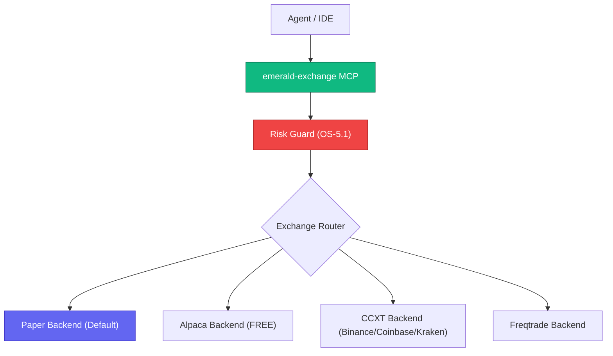

# Emerald Exchange - API | MCP | A2A


*Version: 0.5.0*

## Overview

Emerald Exchange is a unified Finance MCP Server providing fully abstracted exchange backends
for equities, crypto, and derivatives trading. All trading functionality is tool-driven via MCP,
with built-in financial hardening controls (OS-5.1).

**Key Features:**
- **5 Exchange Backends**: Paper (default), Alpaca (FREE), CCXT (100+ exchanges), Freqtrade
- **6 MCP Tool Domains**: market-data, orders, portfolio, risk, signals, strategy
- **Financial Hardening**: Paper-first default, Kelly criterion position sizing, circuit breakers, kill switch
- **Config-Driven**: All settings via `~/.config/agent-utilities/config.json`

## Architecture



## MCP Tools

| Domain | Tool Name | Actions | Tag |
|--------|-----------|---------|-----|
| Market Data | `emerald_market_data` | quote, historical, exchanges | market-data |
| Orders | `emerald_orders` | submit, cancel, status, halt, resume | orders |
| Portfolio | `emerald_portfolio` | positions, account | portfolio |
| Risk | `emerald_risk` | status, drawdown_check, daily_loss_check, kelly, limits | risk |
| Signals | `emerald_signals` | regime, alpha, fuse | signals |
| Strategy | `emerald_strategy` | list, promote, export | strategy |

## Exchange Backends

| Backend | Assets | Paper | Live | Free |
|---------|--------|-------|------|------|
| Paper | All | ✅ | — | ✅ |
| Alpaca | Equities, Crypto | ✅ | ✅ | ✅ |
| CCXT (Binance) | Crypto | ✅ | ✅ | ✅ |
| CCXT (Coinbase) | Crypto | ✅ | ✅ | ✅ |
| CCXT (Kraken) | Crypto | ✅ | ✅ | ✅ |
| Freqtrade | Crypto | ✅ | ✅ | ✅ |

## Financial Hardening (OS-5.1)

| Control | Default |
|---------|---------|
| Trading Mode | Paper (must explicitly opt into live) |
| Max Position Size | 2% of portfolio (Kelly criterion) |
| Max Portfolio Drawdown | 10% auto-halt |
| Max Daily Loss | 3% auto-halt |
| Regime Shift Detection | KS-test auto-halt |
| Human Approval for Live | Required |
| Kill Switch | `emerald_orders(action="halt")` |

## Usage

### MCP Configuration

#### stdio Mode
```json
{
  "mcpServers": {
    "emerald-exchange": {
      "command": "uv",
      "args": ["run", "--with", "emerald-exchange", "emerald-exchange"],
      "env": {}
    }
  }
}
```

#### Streamable HTTP Mode
```bash
emerald-exchange --transport streamable-http --port 8100
```

### Configuration

All trading settings are configured via `~/.config/agent-utilities/config.json`:

```json
{
  "trading": {
    "default_mode": "paper",
    "default_exchange": "alpaca",
    "exchanges": {
      "alpaca": {
        "enabled": true,
        "api_key_env": "ALPACA_API_KEY",
        "api_secret_env": "ALPACA_SECRET_KEY",
        "base_url": "https://paper-api.alpaca.markets"
      }
    },
    "risk_limits": {
      "max_position_pct": 0.02,
      "max_portfolio_drawdown_pct": 0.10,
      "max_daily_loss_pct": 0.03,
      "require_human_approval_live": true
    }
  }
}
```

## ⚙️ Dynamic Tool Selection & Visibility

This MCP server supports dynamic toolset selection and visibility filtering at runtime. This allows you to restrict the set of exposed tools in order to prevent blowing up the LLM's context window.

You can configure tool filtering via multiple input channels:

- **CLI Arguments:** Pass `--tools` or `--toolsets` (or their disabled counterparts `--disabled-tools` and `--disabled-toolsets`) during startup.
- **Environment Variables:** Define standard environment variables:
  - `MCP_ENABLED_TOOLS` / `MCP_DISABLED_TOOLS`
  - `MCP_ENABLED_TAGS` / `MCP_DISABLED_TAGS`
- **HTTP SSE Request Headers:** Pass custom headers during transport initialization:
  - `x-mcp-enabled-tools` / `x-mcp-disabled-tools`
  - `x-mcp-enabled-tags` / `x-mcp-disabled-tags`
- **HTTP SSE Request Query Parameters:** Append query parameters directly to your transport connection URL:
  - `?tools=tool1,tool2`
  - `?tags=tag1`

When query strings or parameters are supplied, an LLM-free **Knowledge Graph resolution layer** (using `DynamicToolOrchestrator`) matches query intents against known tool tags, names, or descriptions, with safe fallback and automated 24-hour background cache refreshing.


---

## Installation

```bash
pip install emerald-exchange           # Core + paper backend
pip install emerald-exchange[alpaca]   # + Alpaca equities
pip install emerald-exchange[crypto]   # + CCXT crypto
pip install emerald-exchange[all]      # Everything
```

## Docker

```bash
docker compose -f docker/compose.yml up -d
```
