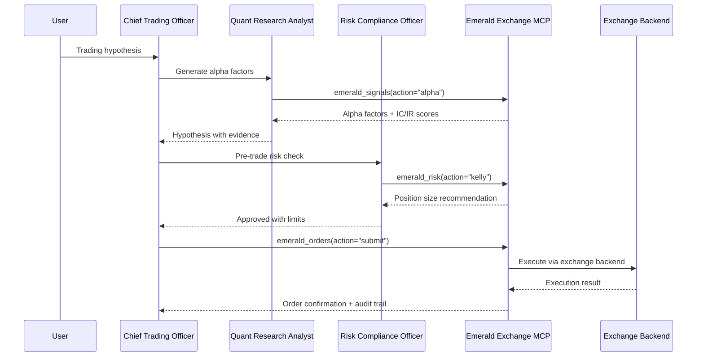

# emerald-exchange — Concept Overview

> **Category**: Finance | **Ecosystem Role**: MCP Server + A2A Agent
> Built on [`agent-utilities`](https://github.com/Knuckles-Team/agent-utilities) — the unified AGI Harness.

## Description

Unified Finance MCP Server providing fully abstracted exchange backends for equities,
crypto, and derivatives trading. All trading operations go through pre-trade risk validation
(OS-5.1 financial hardening) before reaching exchange backends.

## Enterprise Readiness

All agents in the ecosystem inherit enterprise-grade infrastructure from `agent-utilities`:

| Feature | Status | Source |
|:--------|:-------|:-------|
| **JWT/OIDC Authentication** | ✅ Built-in | `agent-utilities[auth]` — Authlib JWKS + API key middleware |
| **OpenTelemetry Instrumentation** | ✅ Built-in | `agent-utilities[logfire]` — OTLP export, FastAPI auto-instrumentation |
| **HashiCorp Vault Integration** | ✅ Built-in | `agent-utilities[vault]` — `secret://`, `env://`, `vault://` URI schemes |
| **Audit Logging** | ✅ Built-in | Append-only compliance trail with 30+ action types (CONCEPT:OS-5.4) |
| **Token Usage Analytics** | ✅ Built-in | 4-bucket tracking with budget alerting (CONCEPT:OS-5.4) |
| **Prompt Injection Defense** | ✅ Built-in | 25+ pattern scanner + jailbreak taxonomy (CONCEPT:OS-5.1) |
| **Guardrail Engine** | ✅ Built-in | Input/output interception with block/redact/warn (CONCEPT:OS-5.3) |
| **Action Execution Pipeline** | ✅ Built-in | Token, cost, duration, and node transition limits (CONCEPT:ORCH-1.4) |
| **Resource Scheduling** | ✅ Built-in | Priority queuing + preemption limits (CONCEPT:OS-5.2) |
| **Session Concurrency** | ✅ Built-in | Enqueue/reject/interrupt/rollback (CONCEPT:OS-5.3) |

## Finance-Specific Features

| Feature | Status | Source |
|:--------|:-------|:-------|
| **Pre-Trade Risk Validation** | ✅ Native | `risk_guards.py` — Kelly criterion, circuit breakers |
| **Kill Switch** | ✅ Native | `emerald_orders(action="halt")` — instant halt |
| **Multi-Exchange Backends** | ✅ Native | Paper, Alpaca, CCXT (Binance/Coinbase/Kraken), Freqtrade |
| **Regime Shift Detection** | ✅ Native | KS-test on prediction distributions |
| **Human Approval Gate** | ✅ Native | Required for live trading activation |
| **Paper-First Default** | ✅ Native | `PaperBackend` is always the default |

## Concept Registry

This project implements or inherits the following ecosystem concepts:

| Concept ID | Description | Source |
|:-----------|:------------|:-------|
| EE-001 | Emerald Exchange MCP Server | This project |
| EE-002 | Exchange Backend Protocol | This project |
| EE-007 | Risk Guards (OS-5.1) | This project |
| EE-008 | Market Data Tools | This project |
| EE-009 | Order Management Tools | This project |
| EE-010 | Portfolio Tools | This project |
| EE-011 | Risk Management Tools | This project |
| EE-012 | Signal Generation Tools | This project |
| EE-013 | Strategy Management Tools | This project |
| ECO-4.1 | MCP & Universal Skills | `agent-utilities` (inherited) |

> 📖 **Full Registry**: See [`agent-utilities/docs/overview.md`](https://github.com/Knuckles-Team/agent-utilities/blob/main/docs/overview.md) for the complete 5-Pillar concept index.

## Architecture

This project follows the standardized agent-package pattern:

```
emerald-exchange/
├── emerald_exchange/          # Source code
│   ├── __init__.py
│   ├── __main__.py            # CLI entrypoint
│   ├── agent_server.py        # A2A agent entrypoint (CONCEPT:EE-020)
│   ├── backends.py            # Exchange backend abstractions
│   ├── risk_guards.py         # OS-5.1 financial hardening
│   ├── mcp_server.py          # MCP server entrypoint
│   └── mcp/                   # MCP tool domains
│       ├── mcp_crypto.py      # Crypto-native analytics, funding rates (CONCEPT:EE-018)
│       ├── mcp_debate.py      # Bull/bear trading debate engine (CONCEPT:EE-019)
│       ├── mcp_market_data.py # Quote, historical, exchanges
│       ├── mcp_orders.py      # Submit, cancel, halt, resume
│       ├── mcp_portfolio.py   # Positions, account
│       ├── mcp_risk.py        # Drawdown, Kelly, limits
│       ├── mcp_signals.py     # Regime, alpha, fusion
│       └── mcp_strategy.py    # List, promote, export
├── tests/                     # Test suite
├── docs/                      # Documentation
├── docker/                    # Container deployment
├── pyproject.toml             # Package metadata
└── mcp_config.json            # MCP server configuration
```

## MCP Configuration

### stdio Mode
```json
{
  "mcpServers": {
    "emerald-exchange": {
      "command": "uv",
      "args": ["run", "--with", "emerald-exchange", "emerald-exchange"],
      "env": {}
    }
  }
}
```

### Streamable HTTP Mode
```bash
emerald-exchange --transport streamable-http --port 8100
```

## Trading Agent Architecture


